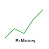

# EzMoney Website



## Overview

EzMoney is a modern fintech startup website that provides real-time stock prices and financial information through a user-friendly interface. This one-page website is designed to showcase the EzMoney application features and collect email addresses from interested users.

## Features

- **Responsive Design**: Optimized for both desktop and mobile devices
- **Modern UI**: Clean and professional look using green, light gray, and dark gray color palette
- **SEO Optimized**: Includes meta tags for better search engine visibility
- **User Engagement**: Email collection form for lead generation
- **Comprehensive Content**: Includes features, testimonials, and FAQs sections

## Technologies Used

- HTML5
- CSS3 (with Flexbox and CSS Grid for layouts)
- JavaScript (ES6+)
- Continuous Deployment with GitHub Actions

## Project Structure

```
ecs-ez-money-website/
├── index.html              # Main HTML file
├── css/
│   └── styles.css          # Main stylesheet
├── js/
│   └── script.js           # JavaScript functionality
├── assets/                 # Images and icons
│   ├── favicon.svg
│   ├── logo.svg
│   ├── hero-image.png
│   └── testimonial-*.jpg   # Testimonial profile images
└── .github/
    └── workflows/
        └── deploy.yml      # GitHub Actions workflow for deployment
```

## Deployment

This website is automatically deployed to GitHub Pages whenever changes are pushed to the main branch, using GitHub Actions.

## Local Development

To run this website locally:

1. Clone the repository
2. Open `index.html` in your browser

No build steps are required as this is a static website.

## License

Copyright © 2025 EzMoney. All rights reserved.
